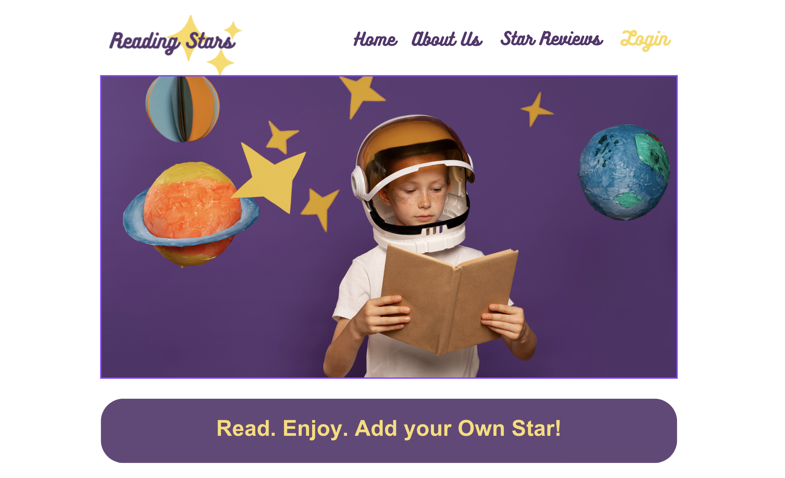
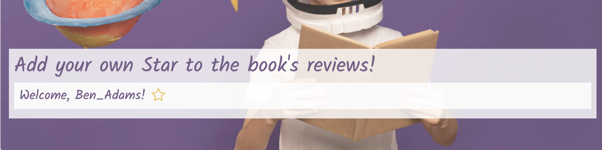

# **⭐️ The Star Readers Blog ⭐️**

The Star Readers is a website for people who want to check out new children's book releases and suggestions of popular books to read. Users are able to create their own posts, comment, and add likes to them. 

## 🔗 [View the live project here.](https://star-readers-4ce320d039d2.herokuapp.com)

---

## CONTENTS

* [User Experience](#user-experience-ux)
  * [Project Goals](#project-goals)
  * [User Stories](#user-stories)

* [Design](#design)
  * [Colour Scheme](#colour-scheme)
  * [Typography](#typography)
  * [Wireframes](#wireframes)
  * [Database Schema](#database-schema) 

* [Agile Development Process](#agile-development-process)

* [Features](#features)

* [Technologies Used](#technologies-used)
  * [Languages Used](#languages-used)
  * [Frameworks, Libraries & Programs Used](#frameworks-libraries--programs-used)

* [Testing](#testing)

* [Deployment & Local Development](#deployment--local-development)
  * [Remote Deployment](#remote-deployment)
  * [Local Deployment](#local-deployment)
    * [How to Fork](#how-to-fork)
    * [How to Clone](#how-to-clone)
    * [Using Gitpod](#using-gitpod)

* [Credits](#credits)
  * [Acknowledgments](#acknowledgments)

## User Experience (UX)

### Project Goals

* To crate a website where users can read about popular kids books and discuss them
* To allow the user to create book review, comment, like and unlike book post
* To provide user the possibility to contact site administaration
* To provide the admin user with the ability to approve, update and delete book reviews in the backend
  
### User Stories

The Agile Methodology was used to plan this project. This was implemented through Github and the Project Board, which can be seen here -  <a href=""> The Star Readers </a>

### Future Developement

* Add books categories
* Add search engine
* Add alert mesages
  
## Design

### Colour Scheme

The colour scheme was chosen using the [Imagecolorpicker](https://imagecolorpicker.com) 

### The main colors used:

- #56376d;
- #eec043;
- white

### Typography

Google Fonts was used to select and import the fonts on this project:
* [Roboto](https://fonts.google.com/specimen/Roboto) 
* [Kalam](https://fonts.google.com/specimen/Kalam?query=kalam)

### Wireframes
The visual of the main page was developed in Canva:

### Database Schema

## Agile Development Process
This project used GitHub Projects Tool to create the Scrum board and use agile methodology. [Link for board:](https://github.com/users/ksumm/projects/7/views/1?visibleFields=%5B%22Title%22%2C%22Assignees%22%2C%22Status%22%2C%22Labels%22%2C%22Milestone%22%5D) 

## Features
* Navbar
  
* Navbar when User logged in
  
* Call to action when User logged in
  
* Contact page
  
* Comments and Edit/Delete post features
     

## Technologies Used

### Languages Used
  - HTML5
  - CSS3
  - JavaScript
  - Python

### Frameworks, Libraries & Programs Used
* [Git](https://git-scm.com/) for version control.
* [GitHub](https://github.com/) to store the project files.
* [Canva](https://www.canva.com/) to create the logo.
* [Django](https://www.djangoproject.com/) as the Python Framework.
* [Heroku](https://www.heroku.com/home/) to deploy the website.
* [ElephantSQL](https://www.elephantsql.com/) to host the database.
* [Cloudinary](https://cloudinary.com/) to host images
* [Django-allauth](https://django-allauth.readthedocs.io/en/latest/) to create accounts.
* [Django Crispy Forms](https://django-crispy-forms.readthedocs.io/en/latest/) to create the forms based on the models.
* [Gunicorn](https://gunicorn.org/) as the webserver to host Django on Heroku.
* [dj-database-url](https://pypi.org/project/dj-database-url/) to create DATABASE_URL to configure the Django application.
* [psycopg2](https://pypi.org/project/psycopg2/) as PostgreSQL adapter.
* [Whitenoise](https://whitenoise.readthedocs.io/en/latest/index.html) to host static files.
* [Tables Generator](https://www.tablesgenerator.com/markdown_tables) to create tables for TESTING.md
* [RandomKeyGen](https://randomkeygen.com/) to create the SECRET_KEY for the project.
* [Google Fonts](https://fonts.google.com/) to import the fonts used on the website.
* [Bootstrap](https://getbootstrap.com/) for layout.
* [Lucidchart](https://lucid.app/) for database schema.

## Testing

Please check the [TESTING.md](TESTING.md) file for all the tests.

## Deployment & Local Development

### Remote Deployment

Before deploying, run 'pip3 freeze > requirements.txt' on the terminal of your IDE of choice.

The site was deployed to Heroku. The steps to deploy are as follows: 
  1. Create an account and log in your [Heroku](https://id.heroku.com/login) account. 
  2. On the dashboard, click on the button New -> Create new app on the right side of the page.
  3. Choose a name and select your region. Click on Create app.
  4. Go to the Settings tab. Scroll down to Config Vars. 
  - Add key PORT and value 8000.
  - Add key DATABASE_URL and add the value of your database on ElephantSQL or other host of choice.
  - Add key CLOUDINARY_URL and add the value of your cloudinary host link.
  - Add key SECRET_KEY and add the value of your choice for this secret key.
  - Add key DISABLE_COLLECTSTATIC and add the value of 1. (Don't forget to remove this key before the final deployment.)
  5. Go to the Deploy tab. Select GitHub as Deployment Method. Connect your account.
  6. Enter the name of the repository that you forked, search and connect.
  7. Select the branch and click Deploy Branch.

The live link can be found here - [The Star Readers](https://star-readers-4ce320d039d2.herokuapp.com/)

### Local Deployment

#### How to Fork

  1. Log In or Sign Up to GitHub.
  2. Go to this project repository https://github.com/ksumm/star-readers-django-pp4
  2. On the top right of the page, there's a button with the option Fork. Click on it.
  3. A new page, "Create a new fork", will open. If you wish, you can edit the name.
  4. At the end of the page, click on "Create fork".
  5. Now, you have a copy of the project in your repositories.

#### How to Clone

  1. Log In or Sign Up to GitHub.
  2. Go to this project repository [https://github.com/ksumm/star-readers-django-pp4](https://github.com/ksumm/star-readers-django-pp4)
  3. Click on the Code button and select if you would like to clone with HTTPS, SSH or GitHub CLI and copy the link.
  4. Open the terminal in the code editor of your choice and change the current working directory to the one you will use for to clone the repository.
  5. Type 'git clone' into the terminal and then paste the link you copied before and press Enter.

#### Using Gitpod
If you would like to edit your copy of this repository on Gitpod, you will need to: 
  1. On your browser of choice, install the Gitpod extension/add-on.
  2. On GitHub, open the project repository you forked before.
  3. On the top of the page, over the files, there is a green button on the right side of the page saying "Gitpod". Click it.
  4. It will open the Gitpod website. On the first time, you will select to connect with your GitHub account and Authorize gitpod-io. After that, you'll create an account.
  5. It might take a while after that because Gitpod will create your workspace.
  After the workspace is loaded, you can edit it on Gitpod.

## Credits

- [this](https://www.youtube.com/watch?v=J7xaESAddDQ&list=PLCC34OHNcOtr025c1kHSPrnP18YPB-NFi&index=6) YouTube tutorial was used to figure out how to develop Edit/Delete post feature.
- [this](https://www.youtube.com/watch?v=E9eWdZTpiGA&list=PLXuTq6OsqZjbCSfiLNb2f1FOs8viArjWy&index=4) YouTube tutorial was used to figure out how to develop Navbar

### Acknowledgments

- I would like to thank my Code Institute mentor, Rory Patrick Sheridan for his support and feedback throughout this project. 
- I would like to thank my Code Institute tutors, Sarah and Sean for their patience and support when I was trying to solve my issue with Update Post functionality.
