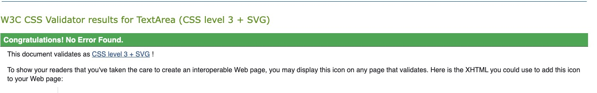
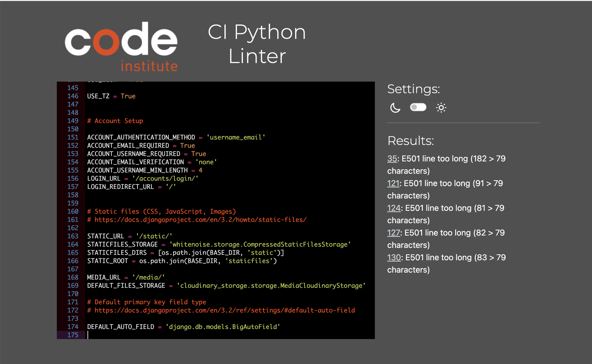
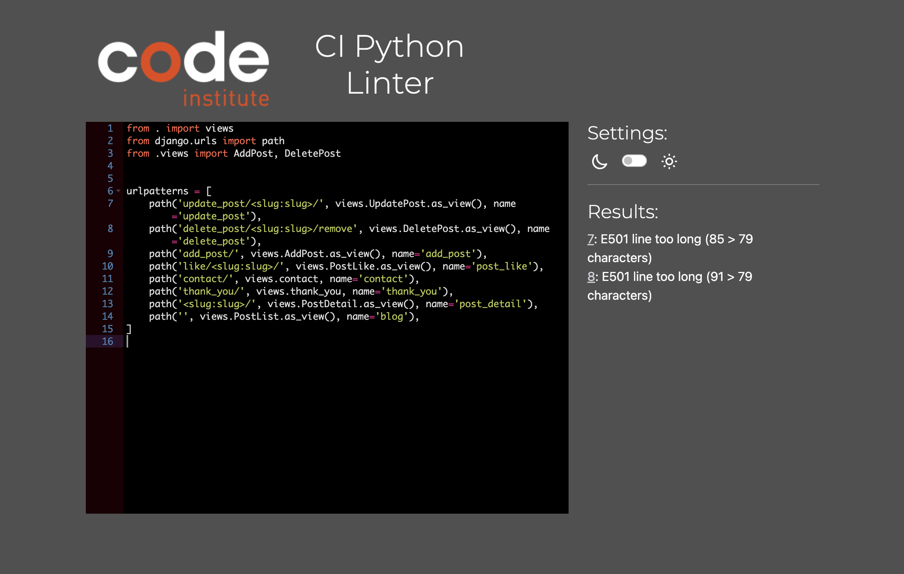
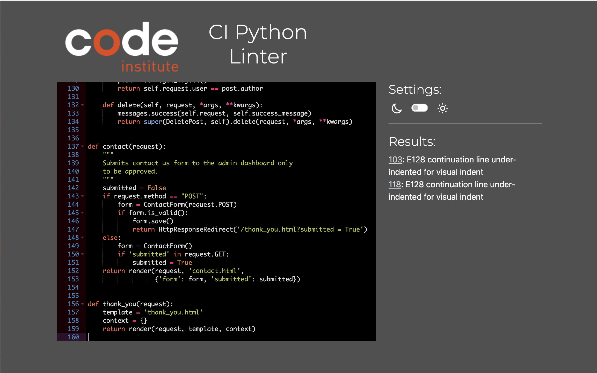
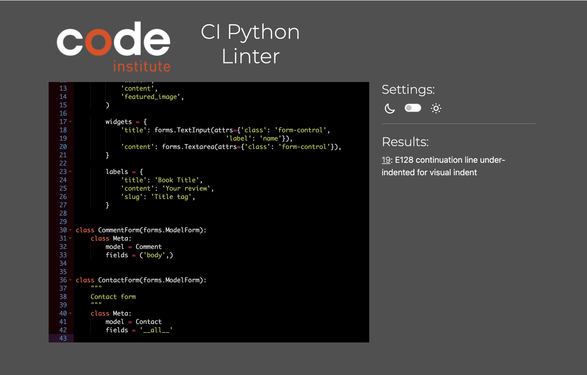
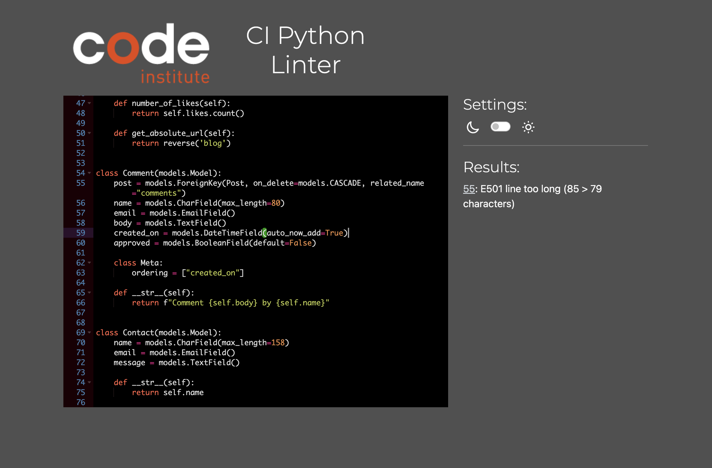
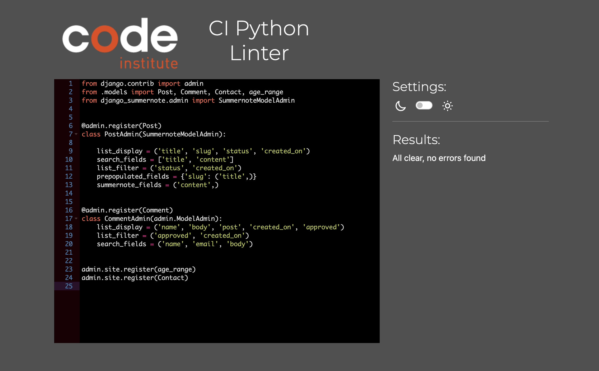
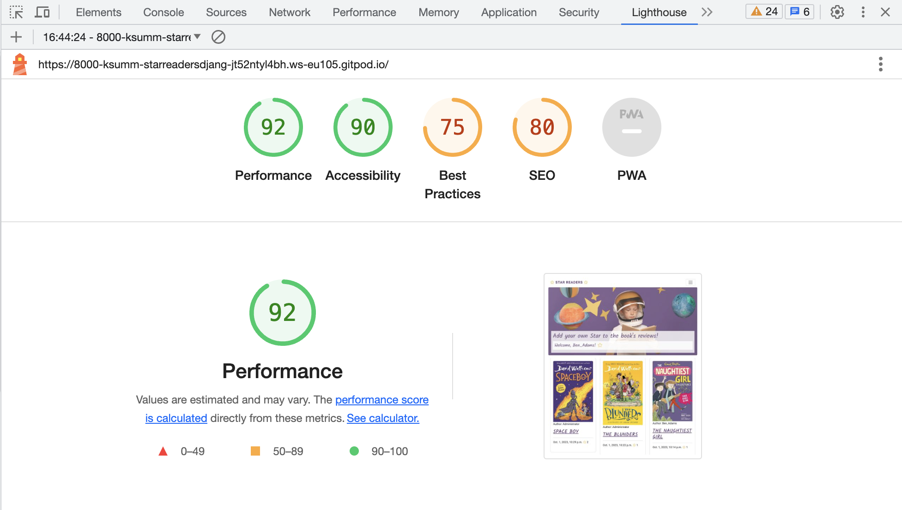

# The Star Readers - TESTING

## VALIDATION

### CSS
The CSS (base.css) was checked on [Jigsaw Validator](https://jigsaw.w3.org/css-validator/) 

### CI Python Linter
The Python was checked on CI Python linter:

 * settings.py
    
   
 * starreaders/urls.py
    

 * blog/urls.py
    

 * blog/views.py
    

 * blog/forms.py
            
             
 * blog/models.py
        

 * blog/admin.py
    
   
### Lighthouse

I used Chrome Developer Tools' Lighthouse to test the Performance, Accessibility, Best practices and SEO of this project.

## MANUAL TESTING

`Nav Bar`

| Feature     | Expected Outcome                                        | Test Performed                              | Result                           | Test Outcome |
|-------------|---------------------------------------------------------|---------------------------------------------|----------------------------------|--------------|
| Logo        | Goes to home page                                       | Click on the logo on the top left.          | Goes to the home page.           | PASS         |
| Home        | Goes to home page when user is not logged in            | Click on the Home menu item.                | Goes to the home page.           | PASS         |
| Login       | Goes to the Login page.                                 | Click on the Login menu item.               | Goes to the login page.          | PASS         |
| Contact Us  | Goes to the Contact Us page.                            | Click on the Contact Us menu item.          | Goes to the Contact Us menu item.| PASS         |
| Logout      | Goes to the Confirm Logout page when user is logged in. | Click on the Logout menu item.              | Goes to the Confirm Logout page. | PASS         |

`Footer`

 Feature                 | Expected Outcome                       | Test Performed              | Result                                            | Test Outcome |
|------------------------|----------------------------------------|-----------------------------|---------------------------------------------------|--------------|
| Github Link            | Goes to the Github page.               | Click on the Github icon.   | Opens a new tab with the  Githubpage.             | PASS         |

`Home Page`

| Feature        | Expected Outcome         | Test Performed             | Result                   | Test Outcome |
|----------------|--------------------------|----------------------------|--------------------------|--------------|
| Sign Up button | Goes to the signup page. | Click on the Signup button | Goes to the signup page. | PASS         |
| Login Button   | Goes to the Login page.  | Click on the Login button. | Goes to the login page.  | PASS         |

`Signup`

| Feature                          | Expected Outcome                                         | Test Performed               | Result                                                   | Test Outcome |
|----------------------------------|----------------------------------------------------------|------------------------------|----------------------------------------------------------|--------------|
| Sign Up Button                   | Submits new user information and create a new account.   | Click on the sign up button. | Submits new user information and create a new account.   | PASS         |
| Sign Up Button - Redirection     | After create new account redirects to the main page.     | Click on the sign up button. | After account is created redirects to the main page.     | PASS         |
| Sign Up Button - Form Validation | Prevent create new account without form filled up.       | Click on the sign up button. | Prevents create new account without form filled up.      | PASS         |

`Login`

| Feature                          | Expected Outcome                                        | Test Performed               | Result                                                   | Test Outcome |
|----------------------------------|---------------------------------------------------------|------------------------------|----------------------------------------------------------|--------------|
| Login Button                     | Submits user login information to access their account. | Click on the sign in button. | Submits user login information to access their account.  | PASS         |
| Login Button - Redirection       | After login redirects to the main page.                 | Click on the sign in button. | After account is created redirects to the main page.     | PASS         |
| Login Button - Form Validation   | Prevent login without form filled up.                   | Click on the sign in button. | Prevent login without form filled up.                    | PASS         |
| Login Button - Message           | Shows a message informing that the user is logged in.   | Click on the sign in button. | Shows a message informing that the user is logged in.    | PASS         |

`Home/blog Page`

| Feature                          | Expected Outcome                                        | Test Performed               | Result                                                   | Test Outcome |
|----------------------------------|---------------------------------------------------------|------------------------------|----------------------------------------------------------|--------------|
| Blog posts                       | Blog posts are shown on the main page                   | Open site link               |  Blog posts are shown on the main page                   | PASS        
| Login/Sign Up Buttons            | Login/Sign Up Buttons are shown on the banner           | Open site link               |  Login/Sign Up Buttons are shown on the banner           | PASS         |
|  Pagination                      | Pagination by 6 is shown if there more than 6 posts     | Open site link               | Pagination by 6 is shown if there more than 6 posts      | PASS         | 

`Add Review Page`

| Feature             | Expected Outcome                                                 | Test Performed                               | Result                                                   | Test Outcome |
|---------------------|------------------------------------------------------------------|----------------------------------------------|---------------------------------------------------------------------|--------------|
| Add review form     |  Add review form is shown after clicking on the Add Review Button| User loged In. Click Add review button       | Add review form is shown after clicking on the Add Review Button | PASS        
| Add Image           | Image is added                                                   | Upload the image                             |  Image is uploaded                                                  | PASS         |
| Create Review button|The form is sent to admin. The main page is opened                | Fill the form. Press the Create Review button| The form is sent to admin. The main page is opened            | PASS         | 

`Edit Review Page`

| Feature             | Expected Outcome                               | Test Performed                               | Result                                         | Test Outcome |
|---------------------|------------------------------------------------|----------------------------------------------|------------------------------------------------|--------------|
| Edit review button  |Edit review form is on the post detail page     | User loged In. Go to the post detail page    | Edit review form is on the post detail page    | PASS         |     
| Edit Review button  |The review is edited and saved                  | Change data. Press the Edit Review button    | The review is edited and saved                 | PASS         | 

`Delete Review Page`

| Feature             | Expected Outcome                                 | Test Performed                               | Result                                          | Test Outcome |
|---------------------|--------------------------------------------------|----------------------------------------------|-------------------------------------------------|--------------|
| Delete review button|  Delete review button is on the post detail page | User loged In. Go to the post detail page    | Delete review button is on the post detail page | PASS         |
|Delete Review button |The review is deleted                             | Press Delete button                          | The review is edited and saved                  | PASS         | 

`Logout`

| Feature         | Expected Outcome                                                          | Test Performed                | Result                                                                    | Test Outcome |
|-----------------|---------------------------------------------------------------------------|-------------------------------|---------------------------------------------------------------------------|--------------|
|LogOut           | Confirms the user wants to leave and logouts. Redirects to the Home Page. | Click on the LogOut Button.   | Confirms the user wants to leave and logout. Redirects to the Home Page. | PASS         |

         

## Bugs
* No alert messages are shown after User edit post, delete post, register account - in development. Will fix in next release
* User can see Edit/Delete post buttons on the posts which were not created by his own - in future development
* No Books categories when the User fills Create Review form  - in development. Will fix in next release

### Fixed Bugs
* 404 page is shown after pressing the Edit Review button : Fixed, [commit ea66877](https://github.com/ksumm/star-readers-django-pp4/commit/ea668775394c9c78fbd38ac0118376f2d56f0068)
